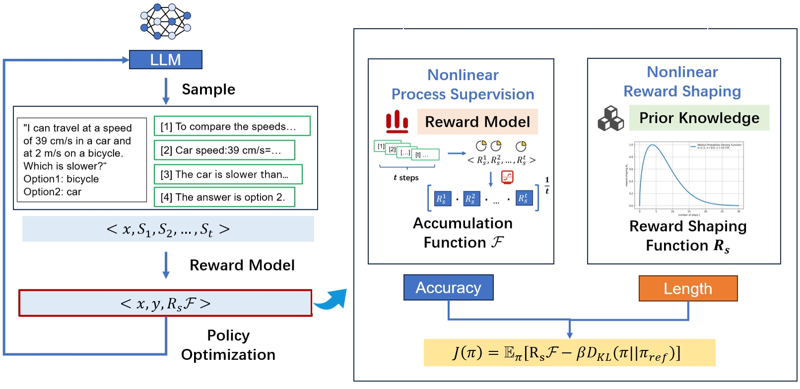

## PSPO*: An Effective Process-supervised Policy Optimization for Reasoning Alignment

<p align="center">    <br> <em>The overall method of PSPO*.</em>    </p>

### What is PSPO*?

PSPO* is not a standalone reinforcement learning algorithm like PPO, TRPO, or SAC. Instead, it is a universal non-linear reward shaping framework that can enhance any existing RL algorithm's performance on complex reasoning tasks.

### How PSPO* Complements Existing RL Algorithms?

PSPO* acts as a plug-and-play enhancement layer that can be integrated with any RL algorithm:

**1. Non-linear Reward Shaping Function.** First, we construct a non-linear function that relates to reasoning steps:
```python
def ff(score, steps):
    """
    Non-linear reward shaping function
    
    Args:
        score (float): base score from reward model
        steps (int): number of reasoning steps
    
    Returns:
        float: shaped reward
    """
    # Hyperparameters
    m = 0.1  # post-threshold growth rate
    k = 0.5  # pre-threshold growth rate
    threshold = 4  # step threshold
    
    # Score thresholds for different behaviors
    E1 = 0.88433  # high score threshold
    E2 = 0.30336  # medium score threshold
    E3 = 0.21159  # low score threshold
    
    if 0 < steps <= threshold:
        # Exponential growth before threshold
        return score * np.exp(k * steps)
    
    elif steps > threshold:
        # Smooth transition using sigmoid
        transition = 1 / (1 + np.exp(-10 * (steps - threshold)))
        base_value = score * np.exp(k * threshold)
        
        # Different growth patterns based on score
        if score > E1:
            # High scores: positive growth
            growth = base_value * np.exp(m * (steps - threshold))
        elif 0 < score < 0.2:
            # Very low scores: negative growth
            growth = base_value * np.exp(-m * (steps - threshold))
        else:
            # Medium scores: scaled growth
            growth = base_value * np.exp(m * (steps - threshold) * (score - E3) / E1)
        
        return base_value * (1 - transition) + transition * growth
```

**2. Base Reward Model** Then, we have the traditional reward calculation using a reward model:
```python
def get_score(sentence):
    """
    Calculate base reward using a reward model
    
    Args:
        sentence (str): input text
    
    Returns:
        torch.Tensor: reward score
    """
    if len(sentence) == 0:
        return torch.tensor(float(0))
    
    inputs = rm_tokenizer(
        sentence, 
        return_tensors="pt", 
        max_length=512, 
        padding='longest', 
        truncation=True
    )
    
    with torch.autocast('cuda', dtype=torch.float16):
        outputs = rm_model(
            input_ids=inputs['input_ids'], 
            attention_mask=inputs['attention_mask']
        )
    
    logits = outputs.logits
    logits_softmax = F.softmax(logits, dim=1)
    score = logits_softmax[0][2]  # Probability of label '1'
    
    return score
```

**3. Combined PSPO\* Reward Function** Finally, we combine both to create the PSPO* reward function:
```python
def get_rewards(texts):
    """
    Calculate PSPO* rewards for a batch of texts
    
    Args:
        texts (List[str]): list of reasoning texts
    
    Returns:
        List[torch.Tensor]: shaped rewards
    """
    rewards = []

    for text in texts:
        # Extract reasoning steps
        step_ls = extract_steps(text)
        step_num = len(step_ls)

        # Handle single-step or empty cases
        if step_num <= 1:
            score = torch.tensor(float(0))
            rewards.append(score)
            log_step_reward(text, score.item())
            continue

        # Calculate step-wise rewards
        step_rewards = []
        for j in range(step_num):
            # Construct step context
            if j == 0:
                sentence = step_ls[j]['text']
                weight = 1.0  # Equal weight for first step
            else:
                sentence = f"{step_ls[j-1]['text']} </s><s> {step_ls[j]['text']}"
                weight = 1.0

            # Get weighted score
            score = get_score(sentence) * weight
            step_rewards.append(score)
            log_step_reward(sentence, score.item())

        # Calculate geometric mean of step rewards
        solution_reward = 1
        for r in step_rewards:
            solution_reward *= r
        mean = float(math.pow(solution_reward, 1/step_num))

        # Apply PSPO* reward shaping
        shaped_reward = mean * ff(mean, step_num)
        rewards.append(shaped_reward)

    return [torch.tensor(r) for r in rewards]

def log_step_reward(step, score):
    """Helper function to log step rewards"""
    data = {'step': step, 'score': score}
    with open(output_dir + 'step_reward.jsonl', 'a+') as f:
        f.write(json.dumps(data) + '\n')
        sys.stdout.flush()
```


## Quick Start

### Requirments

```
python 3.9
torch 2.2.1+cu118
transformers 4.43.3
accelerate 0.33.0
deepspeed 0.9.4
evaluate 0.4.2
scikit-learn 1.5.1
```

To install pytorch 2.2.1, you can follow the instruction on this page https://pytorch.org/get-started/previous-versions/.
For exmaple install with CUDA 11.8 via anaconda:

```bash
conda install pytorch==2.2.1 torchvision==0.17.1 torchaudio==2.2.1 pytorch-cuda=11.8 -c pytorch -c nvidia
```

### Download

You can download our human-labeled dataset, reward model and PSPO-WRS Model at 🤗 [huggingface](https://huggingface.co/codelyh/pspo/tree/main).

### Training
To train the PSPO, we need at least 4 A100-80G GPUs.
Now training with default parameters:

```bash
# deepspeed config path
ds_config_stage2=ds_config_stage2.json

deepspeed --include localhost:0,1,2,3 --master_port=16253 ppo_trl.py \
    --bf16 True \
    --deepspeed $ds_config_stage2 \
    --gradient_checkpointing_kwargs {"use_reentrant":False} \
    --gradient_checkpointing False \
    --use_reentrant False \
    --use_cache False \
```

### Inference
You can choose between two methods for performing inference: using 'pipeline' or 'model.generate'.

**pipeline:**
```bash
CUDA_VISIBLE_DEVICES=0 python pipe_test.py \
--model_path "/output_rl/" \
--out_folder "pipeline_output/" \
--num_beams 5 \
--data_folder "/testsets/" \
--batch_size 4 \
```

**model.generate:**

```bash
CUDA_VISIBLE_DEVICES=0 python abel_test.py \
--model_path "/output_rl/" \
--out_folder "inference_output/" \
--num_beams 5 \
--data_folder "/testsets/" \
--batch_size 4 \
```


### Overall Results
| Models                    | AwpNLI  | NewsNLI | RedditNLI | RTE-Quant | StressTest | QQA    |
|---------------------------|---------|---------|-----------|-----------|------------|--------|
| Llama2-7B (Touvron et al. 2023) | 1.47%   | 0.47%   | 0.40%     | 0.86%     | 1.36%      | 3.70%  |
| BLOOMZ (Muennighoff et al. 2023) | 48.04%  | 54.46%  | 37.20%    | 47.64%    | 31.22%     | 51.85% |
| Abel-7B (Chern et al. 2023)      | 55.82%  | 50.75%  | 47.20%    | 56.67%    | 30.87%     | 48.14% |
| Llama3.1-8B (Dubey et al. 2024)  | 66.18%  | 62.91%  | 39.60%    | 48.93%    | 13.04%     | 50.62% |
| Qwen1.5-7B-chat (Yang et al. 2024) | 54.90%  | 54.93%  | 40.00%    | 21.13%    | 27.32%     | 46.30% |
| CN-PPO (Liang et al. 2024)       | 82.35%  | 61.97%  | 63.20%    | 63.52%    | 46.30%     | 48.77% |
| **PSPO-WRS (Ours)**              | **86.76%** | **64.91%** | **67.60%** | **71.57%** | **52.29%** | **54.70%** |

<br>
The table compares the performance of our method with that of current mainstream LLMs on the mathematic reasoning processing tasks. In comparisons with mainstream models of equivalentsize, PSPO-WRS achieves optimal performance in the AwpNLI,NewsNLI,RedditNLI, RTEQuant, StressTest, and QQAtasks. Specifically, compared to our baseline model Abel-7B, our model achieved significant accuracy improvements of 30.94%, 14.16%, 20.4%, 14.9%, 21.42%, and6.56% across six tasks.These results validate the effectiveness of the methods proposed in out study.
<br><br><br>


